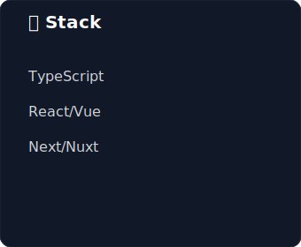

# XeicuLy's GitHub Profile

<!-- Profile Card -->

  

<!-- Stack and Activity Cards -->

  
  

<!-- Language Stats (Optional) -->

  

---

  <i>💡 Check out <a href="https://github.com/xeikit">xeikit</a> - Modern frontend starter toolkit & CLI</i>

