<div align="center">

# Hi, I'm XeicuLy 👋


<br>

</div>

## 💼 What I Do

<table>
<tr>
<td width="50%">

### 🎯 Current Focus

Creating **[xeikit](https://github.com/xeikit)** - starter templates with pre-configured linters and tools.

Get started instantly with:

```bash
npx create-xeikit-app
```

Browse all templates at **[starter-templates](https://github.com/xeikit/starter-templates)**

</td>
<td width="50%">

### 🛠️ Tech Stack


</td>
</tr>
</table>

<br>

## 📊 GitHub Activity



</div>

<br>

## 🎯 Why I Build

> Making frontend development faster by removing repetitive setup work.  
> Every project deserves a great starting point.

<br>

<div align="center">

[](https://github.com/XeicuLy)
[](https://twitter.com/XeicuLy)

</div>
